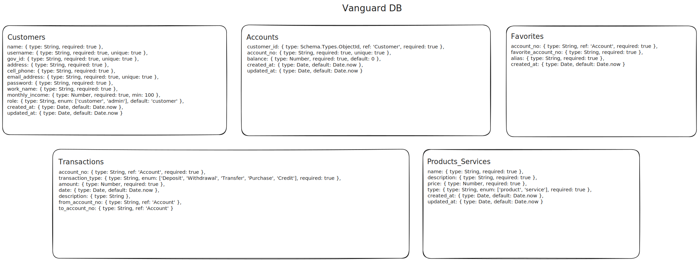

# Vanguard Backend (In Development)

## Important

Hey devs its your scrum! here i will be deploying util information for the back-end team, please remember to attend the sprint reviews, they are every Wednesday, Friday and Sunday at 9:00 P.M. and also remember checking the discord channels for the task distribution and docs, good luck :D

## Database Schema

This is the database schema we will be working with, each collection of MongoDB will need to have this exact attribute structure, with this schema we cover all the application requirements.

## Feature Branches

Based in the database schema we will be working with this feature branches, this feature branches will be distributed in the first sprint review, remember notify me when you done with your functionalities so i can review them and merge it on the develop branch

`feature/customer_management`

- **Purpose**: Manage customer information including registration, updates, and maintenance of customer profiles within the system.
- **Scope of Work**: Creation and management of customer profiles which include fields such as name, username, government ID, address, and contact information. This includes database operations to create, read, update, and delete customer data.

`feature/account_management`

- **Purpose**: Handle all functionalities related to accounts including account creation, balance updates, and tracking of account activities.
- **Scope of Work**: Managing accounts linked to customers, including operations to create new accounts, update account balances, and maintain a history of all account transactions. Integration of these functionalities with the customer profiles.

`feature/transaction_management`

- **Purpose**: Develop the capabilities to process and record different types of transactions such as deposits, withdrawals, transfers, and purchases.
- **Scope of Work**: Implementation of transaction logic that handles various types of financial activities, ensuring accurate record keeping and updating of account balances.

`feature/favorites_management`

- **Purpose**: Provide customers with the functionality to mark certain accounts as favorites for easier access and transaction processing.
- **Scope of Work**: Development of a feature that allows customers to save favorite accounts, manage this list, and perform quick transactions with these favored accounts.

`feature/product_service_management`

- **Purpose**: Manage the products and services offered to customers, including details about each offering.
- **Scope of Work**: Setting up a database schema for products and services, creating management capabilities for adding, updating, and removing product information, and integrating these into the customer service interface.

`feature/authentication_security`

- **Purpose**: Ensure secure access to the system for customers and administrators.
- **Scope of Work**: Implement authentication mechanisms, manage user sessions, and secure user data through proper encryption and security protocols. This include implementing JWT for token management and secure password handling.

`feature/reporting_analytics`

- **Purpose**: Provide analytical insights and reporting features for both customers and administrators.
- **Scope of Work**: Development of reporting tools that allow users to view transaction histories, account balances, and other relevant financial data. For administrators, this could include tools to track user activity, account status, and other metrics.
